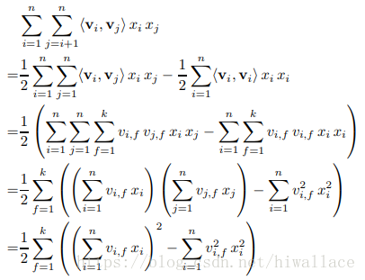
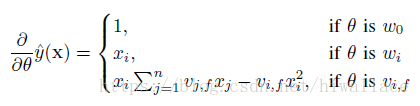

# 推荐算法

目前实用化的工业界的推荐系统通常由两个环节构成，**召回阶段**，**排序阶段**

第一阶段：召回阶段
常用做法：多路召回，每一路召回采取一个不同的策略

## 协同过滤算法

## LFW

## FM系列算法

### FM(Factorization Machines<因子分解机>)

* **基本模型**

$$ \hat{y} = w_0 + \sum^{n}_{i=1}{w_{i}x_{i}} + \sum^{n}_{i = 1}\sum^n_{j=i+1}\langle v_i, v_j\rangle x_i x_j$$

$w_i和v_i$为待求参数(先随机取值，然后通过SGD优化，类似$NN$中的参数)
$\langle v_i, v_j\rangle$:表示特征$x_i$和特征$x_j$组合特征的权重
$x_i.shape = (n, m)$表示样本集有$n$个参数，$m$个样本

* **问题1** <u>为什么$FM$模型解决了数据稀疏性问题</u>

具体来说，$x_h,x_i$和$x_h,x_j$的系数分别为$\langle vh,vi\rangle,\langle vh,vj\rangle$,它们之间的共同项$v_i$,因此所有包含$x_i$的非零组合特征的样本都可以用来学习隐向量$v_i$，很大程度上避免了数据稀疏性造成的影响。

* **优化**
如何利用上述公式直接求各个参数的，那么FM的复杂度为$O(kn^2)$，可以考虑如下优化

求解$\langle v_i,v_j\rangle$，主要用公式$(a+b+c)^2 - a^2 - b^2 - c^2$求得交叉项

通过上述公式的变化，FM模型求解的复杂度降低为$O(kn)$

### FFM

### DeepFM

## Wide&Deep

## SVD
